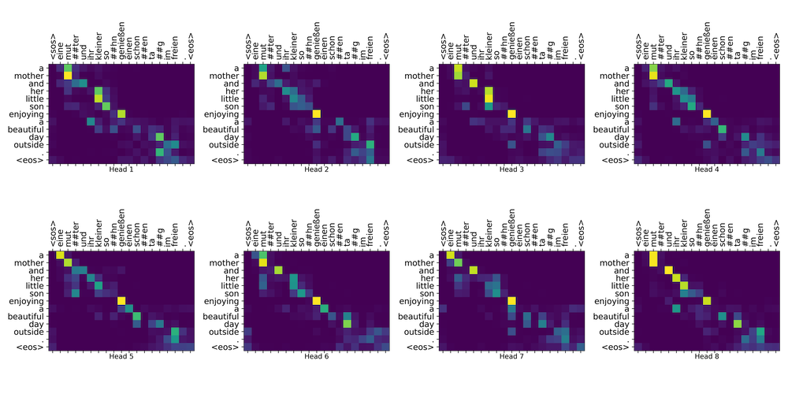
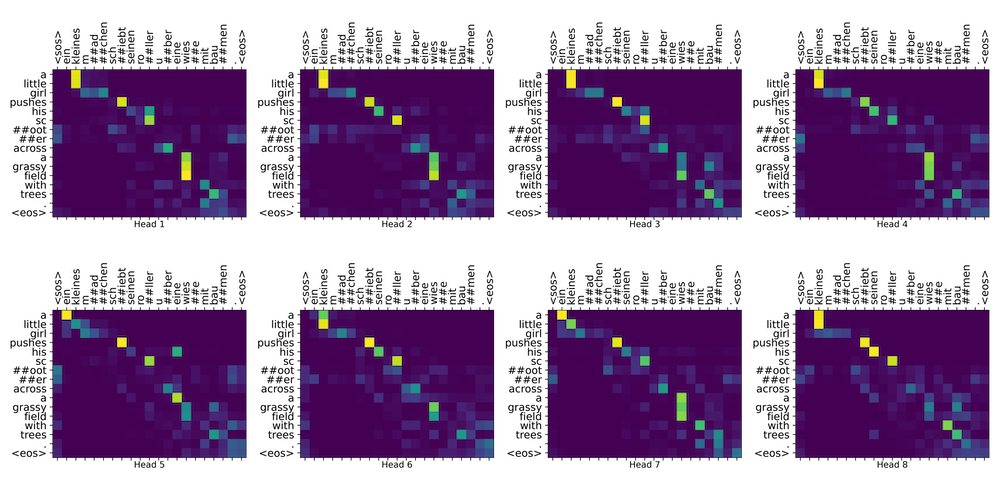
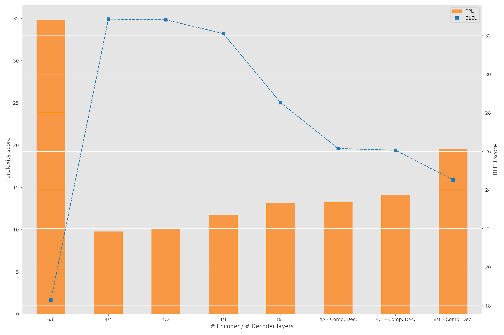
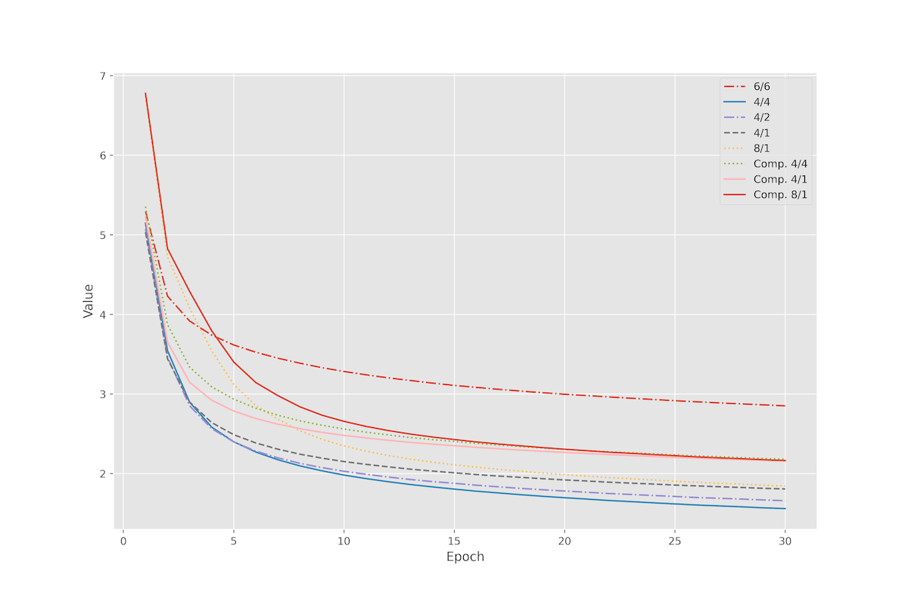

# Master-Thesis

This repository contains the codebase and documentation for my Master Thesis successfully defended on December 2021, at the University of Hildesheim.

# Abstract

**Investigating the Effectiveness of Decoder Attention Mechanisms**

Automatic machine translation applications have helped tremendously in breaking down barriers between languages and cultures. Millions of people around the world use translation applications almost daily, for widely-varying purposes in academia, professional settings, etc. The current state-of-the-art for neural machine translation is "Transformer"-based models, as first introduced in the landmark paper "Attention is All You Need" by Vaswani et al.
(2017). Central to its architecture is the use of self-attention mechanisms in the encoder and decoder blocks. While there have been many published works studying the effectiveness of encoder attention mechanisms, the contributions of the decoder attention mechanisms have not been as well-studied. This thesis investigates how much the attention layers within the decoder block contribute to the Transformer model, and whether the information gain from the encoder block is sufficient to achieve comparable results. The approach was in the form of an ablation study, where experiments of a combination of pruning decoder layers, amplifying encoder layers while minimizing decoder layers, and compressing decoder layers were conducted to study the overall trade-offs between accuracy and efficiency. The results showed that for the two datasets studied, pruning the decoder layers to just one layer produced negligible drop-offs in BLEU scores, while substantially improving training and inference times.

Architecture from Vaswani et. al. (2017):

# Codebase

Most are collected in assorted Jupyter Notebooks. The Python scripts main.py were run in the computing cluster provided by the University [ISMLL](https://www.ismll.uni-hildesheim.de/cluster/cluster_information_en.html)

# Sample Results

Heatmap visualization

BLEU scores

Training curves

